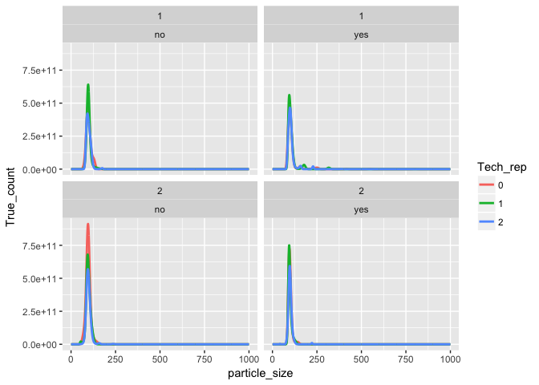

tidyNano 
========================================================================

tidyNano is a package that imports raw NanoSight data and provides the framework to clean, analyze, and visualize nanoparticle analysis data.

Installation
------------

The latest development version can be installed from github:

``` r
# install.packages("devtools")
devtools::install_github("nguyens7/tidyNano")
```

tidyNano Example
----------------

``` r
library(tidyNano)
library(tidyverse)

file <- system.file("extdata", "beads.csv", package = "tidyNano")

data <- nanoimport(file, NTA_version = 3.2)  

data
```

    ## # A tibble: 1,000 x 13
    ##    particle_size std_10000_yes_2_00 std_10000_yes_2_01 std_10000_yes_2_02
    ##            <dbl>              <int>              <int>              <int>
    ##  1           0.5                  0                  0                  0
    ##  2           1.5                  0                  0                  0
    ##  3           2.5                  0                  0                  0
    ##  4           3.5                  0                  0                  0
    ##  5           4.5                  0                  0                  0
    ##  6           5.5                  0                  0                  0
    ##  7           6.5                  0                  0                  0
    ##  8           7.5                  0                  0                  0
    ##  9           8.5                  0                  0                  0
    ## 10           9.5                  0                  0                  0
    ## # ... with 990 more rows, and 9 more variables: std_10000_no_2_00 <int>,
    ## #   std_10000_no_2_01 <int>, std_10000_no_2_02 <int>,
    ## #   std_10000_yes_1_00 <int>, std_10000_yes_1_01 <int>,
    ## #   std_10000_yes_1_02 <int>, std_10000_no_1_00 <int>,
    ## #   std_10000_no_1_01 <int>, std_10000_no_1_02 <int>

``` r
tidy_data <- data  %>% 
  nanotidy(col = 2:13, 
           sep_var = c("Sample", "Dilution","Filter","Injection","Tech_rep"))

tidy_data
```

    ## # A tibble: 12,000 x 8
    ##    particle_size Sample Dilution Filter Injection Tech_rep Count
    ##            <dbl> <fct>     <dbl> <fct>  <fct>     <fct>    <dbl>
    ##  1           0.5 std       10000 yes    2         0            0
    ##  2           1.5 std       10000 yes    2         0            0
    ##  3           2.5 std       10000 yes    2         0            0
    ##  4           3.5 std       10000 yes    2         0            0
    ##  5           4.5 std       10000 yes    2         0            0
    ##  6           5.5 std       10000 yes    2         0            0
    ##  7           6.5 std       10000 yes    2         0            0
    ##  8           7.5 std       10000 yes    2         0            0
    ##  9           8.5 std       10000 yes    2         0            0
    ## 10           9.5 std       10000 yes    2         0            0
    ## # ... with 11,990 more rows, and 1 more variable: True_count <dbl>

``` r
tidy_data %>% 
  ggplot(aes(x = particle_size, y = True_count, color = Tech_rep)) +
  geom_line(size = 1) +
  facet_wrap(Injection ~ Filter)
```


